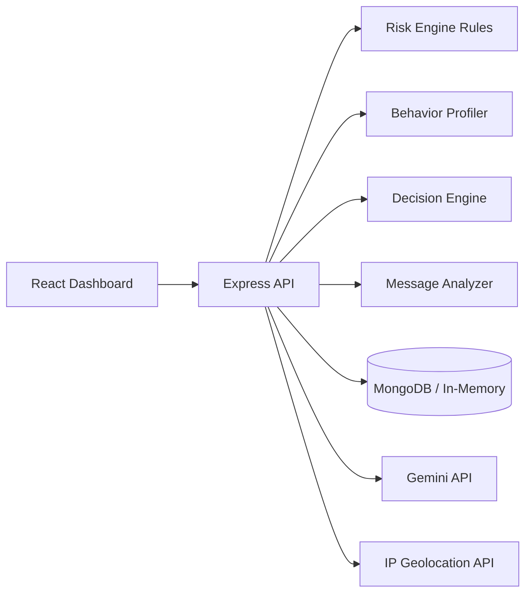

# Product Requirements Document (PRD)
# FinShield - AI-Powered Fintech Security Platform

## 1. Product Overview
FinShield is a hackathon-ready fintech security platform that performs real-time risk checks on transactions and detects fraud in text messages (phishing/scam content). It combines:
- A lightweight, rule-based risk engine with behavioral profiling
- AI-generated explanations for analyst/user readability
- A message fraud classifier powered by free-tier LLM APIs

The product is designed for a **2-day implementation**, prioritizing demo impact, clarity, and modularity over production-scale complexity.

## 2. Objectives and Goals
### Primary Objectives (48-hour MVP)
- Detect risky transactions before approval using deterministic scoring rules
- Classify messages into `FRAUD`, `SUSPICIOUS`, or `SAFE`
- Provide human-readable AI explanations for both modules
- Offer a simple dashboard with live simulation, alerts, and decision visibility

### Success Criteria
- Transaction decision latency under 1.5 seconds (excluding optional AI explanation call)
- Message classification response under 2 seconds (API dependent)
- At least 5 realistic demo scenarios covering normal, suspicious, and fraud behaviors
- End-to-end flow works with only free-tier/no-cost APIs

## 3. Problem Statement
Fintech platforms face two common threats:
1. **Transaction fraud**: abnormal transaction amount, unusual geolocation/device/time patterns, and rapid transfer bursts.
2. **Social engineering and phishing**: malicious messages that trick users into sharing credentials or sending money.

Teams in early-stage products often need a practical security layer that is fast to build, easy to explain, and effective enough for first-line defense.

## 4. Scope
### MVP Scope (In Hackathon)
- Transaction simulation (manual form + optional auto generator)
- Rule-based transaction risk scoring
- Behavioral profiling using synthetic history (existing users)
- Cold-start heuristics for new users
- Decision engine: `APPROVE`, `REVIEW`, `BLOCK`
- AI explanation for risk decisions
- Message fraud detection with AI classification + explanation
- Basic dashboard with alerts and summary metrics
- REST APIs for all essential workflows

### Out of Scope (Post-Hackathon)
- Real-time bank integrations/payment rails
- Advanced ML model training pipelines
- Streaming architecture (Kafka, Flink, etc.)
- Multi-tenant RBAC and enterprise SSO
- Full compliance tooling (PCI DSS automation, SOC2 controls)

### Future Scope (Realistic)
- Device fingerprinting and velocity checks per merchant
- Feedback loop for analyst-reviewed labels
- Rules management UI (non-code rule editing)
- Model confidence calibration and explainability audit logs

## 5. System Architecture (Simple and Clear)
### Architecture Summary
Single deployable web app with one backend service and one frontend client.

- **Frontend**: React + Tailwind CSS
- **Backend**: Node.js + Express
- **Storage**: MongoDB (Atlas free tier) or in-memory fallback
- **External APIs**:
  - Primary LLM: Google Gemini API (free tier)
  - Optional LLM fallback: OpenAI (only if free credits available)
  - Optional geolocation enrichment: ipapi/ipinfo free tier

### High-Level Flow


### Design Principles
- Keep all logic in one backend codebase
- Deterministic rule engine first, AI as explanation/classification layer
- Graceful degradation if external APIs fail

## 6. User Roles
| Role | Description | Key Actions |
|---|---|---|
| Fraud Analyst (Primary Demo User) | Monitors suspicious activities | Review flagged transactions/messages, inspect explanations |
| Ops/Admin (Secondary) | Runs simulation and observes system behavior | Trigger simulation, view dashboard metrics |

## 7. Data Models
### User Model
```json
{
  "_id": "u_101",
  "name": "Riya Sharma",
  "email": "riya@example.com",
  "isNewUser": false,
  "homeCountry": "IN",
  "usualDevices": ["android_pixel", "mac_chrome"],
  "avgTxnAmount": 3200,
  "txnCount30d": 42,
  "lastActiveAt": "2026-03-22T09:30:00Z",
  "createdAt": "2026-02-01T12:00:00Z"
}
```

### Transaction Model
```json
{
  "_id": "t_9001",
  "userId": "u_101",
  "amount": 25000,
  "currency": "INR",
  "merchant": "QuickPay Wallet",
  "category": "P2P",
  "channel": "MOBILE",
  "ipAddress": "103.120.45.88",
  "deviceId": "android_pixel",
  "geoCountry": "IN",
  "timestamp": "2026-03-22T10:05:00Z",
  "riskScore": 78,
  "riskFactors": ["HIGH_AMOUNT_SPIKE", "UNUSUAL_HOUR"],
  "decision": "REVIEW",
  "explanation": "Amount is ~8x user's average and transaction occurred at unusual hour.",
  "createdAt": "2026-03-22T10:05:01Z"
}
```

### Message Model
```json
{
  "_id": "m_450",
  "userId": "u_101",
  "text": "You won Rs10000! Click http://claim-prize-now.biz",
  "source": "SMS",
  "classification": "FRAUD",
  "confidence": 0.93,
  "signals": ["PRIZE_BAIT", "SUSPICIOUS_LINK", "URGENCY"],
  "explanation": "Message contains prize bait + suspicious URL pattern.",
  "createdAt": "2026-03-22T10:08:00Z"
}
```

## 8. Feature Breakdown
### 8.1 Transaction Risk Engine
- Input: transaction + user profile + recent history
- Output: risk score (0-100), factors, decision
- Works for both existing and new users

### 8.2 Rule Engine (Simple Scoring Logic)
Use additive scoring with capped max = 100.

| Rule | Condition | Score |
|---|---|---|
| High Amount Spike | `amount > 3 * avgTxnAmount` | +25 |
| Very High Absolute Amount | `amount > 50000 INR` | +20 |
| New Device | `deviceId not in usualDevices` | +15 |
| Geo Mismatch | `geoCountry != homeCountry` | +20 |
| Off-Hours Activity | local time 00:00-05:00 | +10 |
| Velocity Burst | >=3 txns in 5 min | +20 |
| Known Risky Merchant Keyword | merchant contains flagged pattern | +10 |

Risk bands:
- `0-34` -> `APPROVE`
- `35-69` -> `REVIEW`
- `70-100` -> `BLOCK`

### 8.3 Cold Start Handling
For `isNewUser = true` or insufficient history:
- Skip behavioral delta rules requiring baseline averages
- Apply conservative default baseline:
  - `avgTxnAmountDefault = 5000 INR`
  - stricter threshold on new device + geo mismatch
- Tag result with `COLD_START_APPLIED`

### 8.4 AI Risk Explanation Layer
- Purpose: convert structured rule outputs into understandable analyst notes
- Input to AI: risk score + triggered rules + transaction context
- Output: short explanation (2-4 lines), recommended action hint
- If AI unavailable: deterministic template explanation

Example fallback template:
```text
Risk score 78 due to HIGH_AMOUNT_SPIKE (+25), NEW_DEVICE (+15), and OFF_HOURS_ACTIVITY (+10). Decision: REVIEW.
```

### 8.5 Decision Engine
Deterministic threshold-based decisioning:
```js
if (riskScore >= 70) decision = 'BLOCK';
else if (riskScore >= 35) decision = 'REVIEW';
else decision = 'APPROVE';
```

### 8.6 Message Fraud Detection
- Input: message text (+ optional source channel)
- AI prompt asks for strict JSON output with:
  - `classification`: FRAUD | SUSPICIOUS | SAFE
  - `confidence`: 0 to 1
  - `signals`: short array (e.g., URGENCY, THREAT, LINK_OBFUSCATION)
  - `explanation`
- Fallback rule checks if AI fails:
  - suspicious URL patterns
  - prize/lottery keywords
  - urgent CTA patterns ("act now", "account blocked")

## 9. API Design (Essential Endpoints)
Base path: `/api/v1`

### Health
`GET /api/v1/health`

Response:
```json
{ "status": "ok", "time": "2026-03-22T10:10:00Z" }
```

### Users
`POST /api/v1/users` - Create synthetic user

Request:
```json
{
  "name": "Riya Sharma",
  "email": "riya@example.com",
  "homeCountry": "IN",
  "isNewUser": false
}
```

`GET /api/v1/users/:id` - Get user profile

### Transactions
`POST /api/v1/transactions/evaluate` - Evaluate single transaction

Request:
```json
{
  "userId": "u_101",
  "amount": 25000,
  "currency": "INR",
  "merchant": "QuickPay Wallet",
  "category": "P2P",
  "channel": "MOBILE",
  "ipAddress": "103.120.45.88",
  "deviceId": "android_pixel",
  "timestamp": "2026-03-22T10:05:00Z"
}
```

Response:
```json
{
  "transactionId": "t_9001",
  "riskScore": 78,
  "riskFactors": ["HIGH_AMOUNT_SPIKE", "UNUSUAL_HOUR"],
  "decision": "REVIEW",
  "explanation": "Amount significantly exceeds user's pattern and occurred during low-trust hour.",
  "coldStartApplied": false
}
```

`POST /api/v1/transactions/simulate` - Generate N synthetic transactions

Request:
```json
{ "userId": "u_101", "count": 20, "mode": "mixed" }
```

### Messages
`POST /api/v1/messages/analyze` - Classify message risk

Request:
```json
{
  "userId": "u_101",
  "text": "You won Rs10000 click here http://fake-link.biz",
  "source": "SMS"
}
```

Response:
```json
{
  "messageId": "m_450",
  "classification": "FRAUD",
  "confidence": 0.93,
  "signals": ["PRIZE_BAIT", "SUSPICIOUS_LINK"],
  "explanation": "Prize lure and suspicious external link indicate phishing intent."
}
```

### Dashboard
`GET /api/v1/dashboard/summary` - KPI cards and counts

Response:
```json
{
  "transactionsToday": 120,
  "approveCount": 88,
  "reviewCount": 22,
  "blockCount": 10,
  "fraudMessages": 14
}
```

## 10. Database Schema (Simple Collections)
### MongoDB Collections
- `users`
- `transactions`
- `messages`
- `alerts` (optional lightweight)

### Suggested Indexes
- `transactions`: `{ userId: 1, timestamp: -1 }`
- `transactions`: `{ decision: 1, createdAt: -1 }`
- `messages`: `{ classification: 1, createdAt: -1 }`
- `users`: `{ email: 1 }` unique

### In-Memory Fallback
If Mongo setup slows hackathon pace:
- Keep arrays/maps in service layer
- Persist optional JSON snapshots to local file for demo continuity

## 11. Backend Design (Minimal Folder Structure)
```text
backend/
  src/
    app.js
    server.js
    config/
      env.js
      db.js
    routes/
      health.routes.js
      users.routes.js
      transactions.routes.js
      messages.routes.js
      dashboard.routes.js
    controllers/
      users.controller.js
      transactions.controller.js
      messages.controller.js
      dashboard.controller.js
    services/
      riskEngine.service.js
      decisionEngine.service.js
      behaviorProfile.service.js
      messageAnalyzer.service.js
      aiExplanation.service.js
      geoEnrichment.service.js
      simulation.service.js
    models/
      user.model.js
      transaction.model.js
      message.model.js
    utils/
      logger.js
      errors.js
      validators.js
```

Implementation notes:
- Keep business logic in `services/`
- Keep controllers thin (request/response only)
- Add simple request validation (Joi/Zod optional)

## 12. Frontend Design (Pages and UI Behavior)
### Pages
1. `DashboardPage`
- KPI cards: Approve/Review/Block/Fraud Messages
- Recent alerts table
- Small trend chart (optional)

2. `TransactionSimulatorPage`
- Manual transaction form
- "Evaluate" button returns score, factors, decision
- "Auto Generate" button creates burst scenarios

3. `MessageScannerPage`
- Text input for message content
- Analyze button with classification badge and explanation

4. `AlertsPage` (optional if time)
- Consolidated suspicious transactions/messages

### UI Behavior
- Decision badges:
  - APPROVE = green
  - REVIEW = amber
  - BLOCK = red
- Show risk factors as chips/tags
- Graceful loading and API error states
- Keep single-page navigation with React Router

## 13. External API Integration (Free-Tier Focused)
### Recommended API Choices
| Use Case | Primary | Free-Tier Notes | Fallback |
|---|---|---|---|
| LLM classification + explanation | Google Gemini API | Generous free tier; easy API key setup via Google AI Studio | OpenAI only if free credits exist; else local rule templates |
| IP geolocation (optional) | ipapi.co | Free request quota; no card required for basic use | ipinfo.io free tier, or skip geolocation enrichment |

### API Selection Guidance
- **Default choice**: Gemini for both explanation + message classification
- **Avoid lock-in**: create `AIProvider` interface with `geminiProvider` and optional `openaiProvider`
- **No paid dependency rule**: if quota exhausted, switch to fallback deterministic explanations/rules

### Example Gemini Prompt Contract
```json
{
  "task": "Classify fintech message risk",
  "output_format": {
    "classification": "FRAUD|SUSPICIOUS|SAFE",
    "confidence": "0-1",
    "signals": ["string"],
    "explanation": "string"
  },
  "message": "You won Rs10000 click here http://fake-link.biz"
}
```

## 14. Non-Functional Requirements (Basic)
- **Performance**: core rule evaluation < 300ms in local setup
- **Reliability**: fallback logic when external APIs fail
- **Security**:
  - Store API keys in `.env`
  - Basic input validation and sanitization
  - Rate limit public endpoints (simple middleware)
- **Observability**: request logs + error logs in console
- **Usability**: decisions and explanations visible in under 2 clicks

## 15. Demo Scenarios (Hackathon-Critical)
1. **Normal Existing User Payment**
- Low amount, known device, same country
- Expected: `APPROVE`

2. **High Amount + New Device**
- Existing user makes 10x normal transfer from new device
- Expected: `REVIEW` or `BLOCK`

3. **Geo Mismatch + Velocity Burst**
- Multiple transactions from non-home country within minutes
- Expected: `BLOCK`

4. **Cold Start New User Legitimate Transaction**
- New user first transaction moderate amount
- Expected: likely `REVIEW` (conservative)

5. **Phishing SMS with Malicious Link**
- "Your account blocked, verify now: fake-link"
- Expected: `FRAUD`

6. **Benign Reminder Message**
- "Your EMI is due tomorrow"
- Expected: `SAFE`

## 16. Edge Cases (Basic Handling)
- Missing user profile -> return `400` with validation error
- Unknown userId -> return `404`
- External AI API timeout -> return result with fallback explanation/classification
- Geolocation API unavailable -> continue without geo score component
- Non-English or mixed-language message -> still attempt AI classification; fallback keyword rules if parse fails
- Score overflow -> cap to `100`

## 17. Future Enhancements (Realistic)
- Analyst feedback button (`correct classification`) to improve rule tuning
- Rule editor UI with enable/disable toggles
- Merchant risk profile repository
- Exportable incident report PDF/CSV
- Webhook integration to notify Slack/Teams on `BLOCK` events

---

## Build Plan (48-Hour Execution Reference)
### Day 1
- Set up backend + frontend skeleton
- Implement transaction risk engine + decision logic
- Implement user/transaction models and APIs
- Build simulator UI and decision display

### Day 2
- Add message analyzer with Gemini integration
- Add AI explanation layer + fallbacks
- Build dashboard summary + alerts view
- Polish demo data, seed scripts, and scenario walkthrough

---

## Route Checklist (Hackathon Ready)
- `GET /api/v1/health`
- `POST /api/v1/users`
- `GET /api/v1/users/:id`
- `POST /api/v1/transactions/evaluate`
- `POST /api/v1/transactions/simulate`
- `POST /api/v1/messages/analyze`
- `GET /api/v1/dashboard/summary`

This route set is intentionally minimal and sufficient for a complete, demo-friendly MVP.